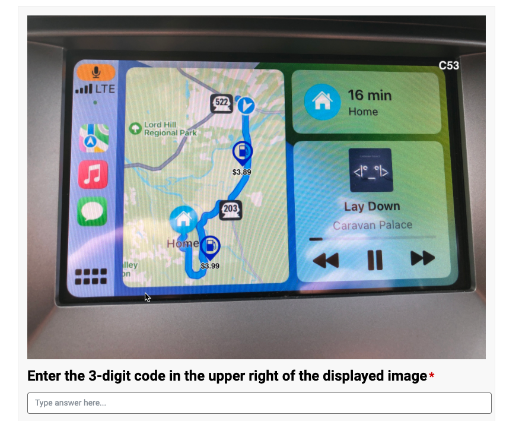

# Image order "Randomizer"

Display images in an alternating order based on a querystring ID.  Used in randomizing the order in which prototypes are presented to survey participants.

The Azure Function returns the image content, replacing the image link in the PeerSurvey interface:

## Environment Overview

### Storage Account
Create a storage account and a blob storage container.  Upload your prototype images to the container.

### Azure Function
2 environment variables (app settings) are required:
- AZURE_STORAGE_CONNECTION_STRING": connection string with storage account access key  (eg "DefaultEndpointsProtocol=https;AccountName=omscs;AccountKey=thisreallylongstringwithcharactersandnumbersandstuffbutreallysuperlong;EndpointSuffix=core.windows.net")
- "AZURE_STORAGE_CONTAINER_NAME": string name of container with images in it (eg "carplay")

## Example Use
The 2 images below will switch places every minute.

The image URL is the function URL + a querystring for the image placement.  For example the first one is https://image-selector.azurewebsites.net/api/GetImage?imageID=1.

Image 1:

Image 2:

